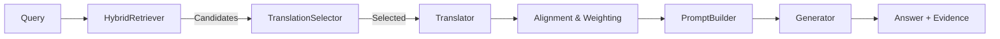

---

# 📘 LBRAG モジュール概要

本プロジェクトは、**LBRAG（Language-Bridged Retrieval-Augmented Generation）** を実装した Python モジュールです。
多言語環境において、効率的な検索・翻訳・生成を行うためのパイプラインを構成しています。

---

## 🗂️ ファイル構成と役割

### **1️⃣** **`__init__.py`**

モジュールのエントリーポイント。
他ファイルで定義された主要クラス・関数をまとめて公開します。
→** **`from lbrag import LBRAGPipeline, cost_normalized_bridging_efficiency` のように簡単にインポート可能。

---

### **2️⃣** **`types.py`**

基本的なデータ構造を定義。
LBRAG 全体で共通して使われるデータクラスを含みます。

* `Query`：質問（テキスト＋言語＋メタ情報）
* `DocumentSegment`：文書断片（識別子・本文・言語など）
* `RetrievalCandidate`：検索候補とスコア情報
* `TranslationRequest` /** **`TranslationResult`：翻訳の入出力
* `SentenceAlignment`：文単位のアラインメント結果
* `EvidenceBlock`：最終的に生成モデルに渡す証拠ブロック

---

### **3️⃣** **`retrieval.py`**

多言語情報検索の中核。
複数のリトリーバーを統合する** ****HybridRetriever** を実装。

* `Retriever` /** **`Reranker`：抽象プロトコル
* `RetrievalConfig`：検索設定（上位件数・α値など）
* `HybridRetriever`：複数言語の検索結果を統合し、再ランキングを適用

---

### **4️⃣** **`integrations.py`**

外部 API（主に OpenAI）との連携を実装。

* `OpenAIEmbeddingRetriever`：OpenAI 埋め込みモデルを利用した検索
* `OpenAIListwiseReranker`：Chat モデルによるリスト型再ランキング
* `OpenAITranslator`：Chat モデルを翻訳器として使用
* `OpenAIChatGenerator`：最終的な回答生成器
* `TavilyRetriever`,** **`QdrantRetriever`：外部検索／ベクトルDBとの接続例

---

### **5️⃣** **`translation.py`**

文分割・翻訳補助・アラインメント関連のロジック。

* `SimpleSentenceSplitter`,** **`RegexSentenceSplitter`：言語非依存の文分割
* `greedy_sentence_alignment()`：文単位でソース・ターゲットを貪欲に対応付け
* `_extract_slot_matches()`：数値・日付・固有名などの一致を抽出
* `estimate_alignment_quality()`：カバレッジとスロット一致度を算出

---

### **6️⃣** **`selection.py`**

翻訳予算の最適配分ロジックを実装。

* `TranslationCandidate`：各候補の関連度・信頼度・コスト情報
* `TranslationSelector`：効率（relevance × confidence / cost）に基づく選択
* `TranslationPlan`：選択・スキップ済み候補と実際の消費コストを記録

---

### **7️⃣** **`prompting.py`**

生成モデルへ渡すプロンプトを構築。

* `PromptTemplate`：テンプレート文（system / citation / answer 指示）
* `PromptBuilder`：質問・証拠ブロックを整形して最終プロンプトを生成
  * 証拠文の長さ制限・翻訳済み文の統合などを処理

---

### **8️⃣** **`pipeline.py`**

LBRAG 全体の制御フローを実装するメインクラス。

* `LBRAGPipeline`：
  1. 検索 (`HybridRetriever`)
  2. 翻訳候補選択 (`TranslationSelector`)
  3. 翻訳・アラインメント
  4. 証拠統合とプロンプト生成
  5. 回答生成 (`Generator`)
     を一括実行する。
* `WeightingConfig`：証拠スコアの重み設定（検索・アラインメント・スロット）
* `default_pivot()`：ピボット言語選択（例：en ↔ ja 切替）

---

### **9️⃣** **`metrics.py`**

評価指標モジュール。

* `response_language_consistency()`：生成文の言語一貫性を測定
* `cost_normalized_bridging_efficiency()`：翻訳コストあたりの性能改善度（CNBE）

---

## 🚀 全体のデータフロー

---

## 🧠 要約

| 階層           | ファイル                              | 主な役割                   |
| -------------- | ------------------------------------- | -------------------------- |
| 基盤構造       | `types.py`                          | データ定義                 |
| 検索           | `retrieval.py`, `integrations.py` | 多言語検索と再ランキング   |
| 翻訳           | `translation.py`, `selection.py`  | 翻訳選択・文アラインメント |
| プロンプト生成 | `prompting.py`                      | 証拠付きプロンプト構築     |
| 統合制御       | `pipeline.py`                       | パイプライン全体制御       |
| 評価           | `metrics.py`                        | CNBE / RLC 指標            |
| 初期化         | `__init__.py`                       | モジュール公開             |
